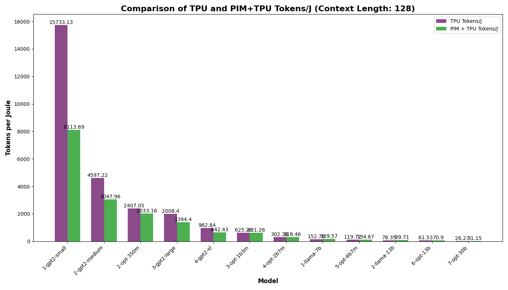
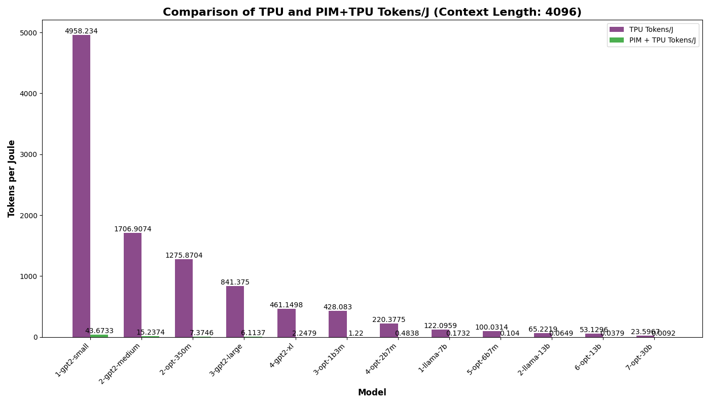
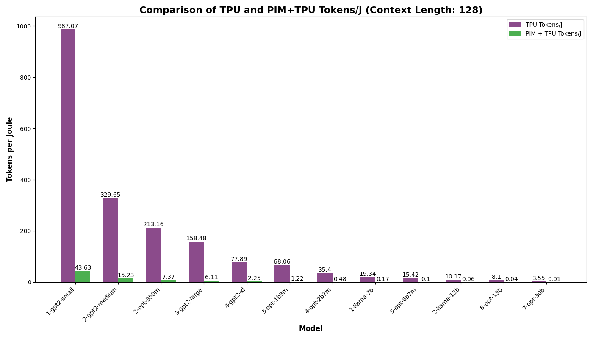
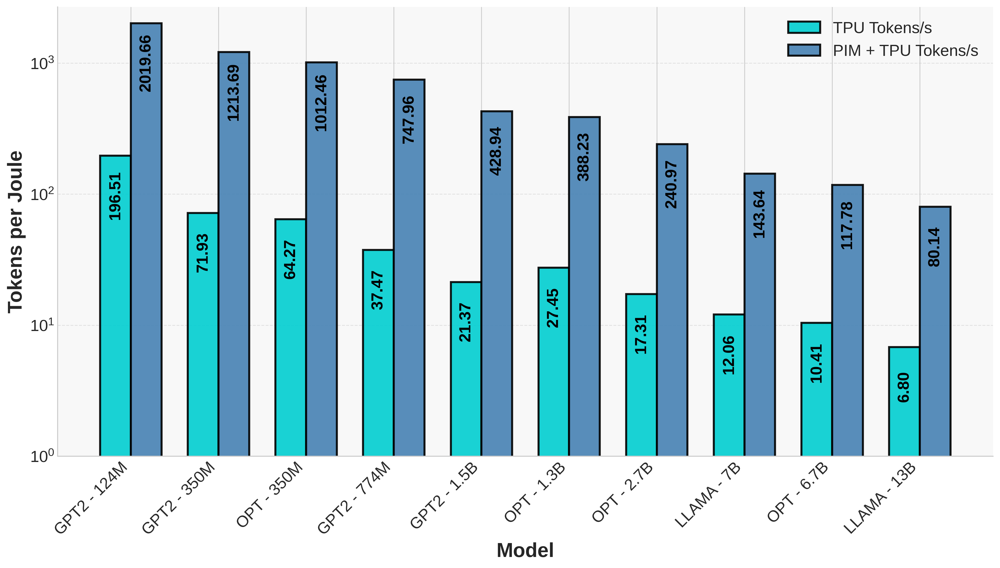

## Updates - September 22, 2024

- Converted tokens per second for various context lengths tokens/seconds/watt.
- Extracted and organized data into CSV files, including:
  - Power
  - Energy.
  - Made a pie chart for power as well as energy.

Tokens/sec/watt simulation results:

| Edge Context Length 128 | Edge Context Length 4096 |
|-------------------------|---------------------------|
|  |  |

| Cloud Context Length 128 | Cloud Context Length 4096 |
|--------------------------|---------------------------|
|  |  |

