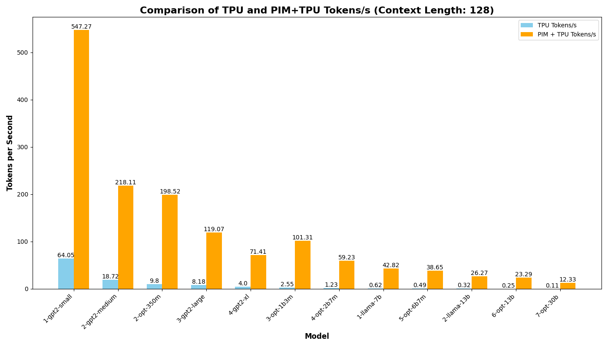
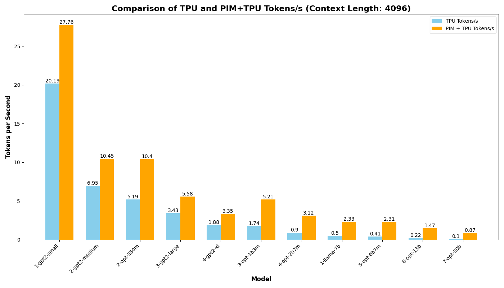
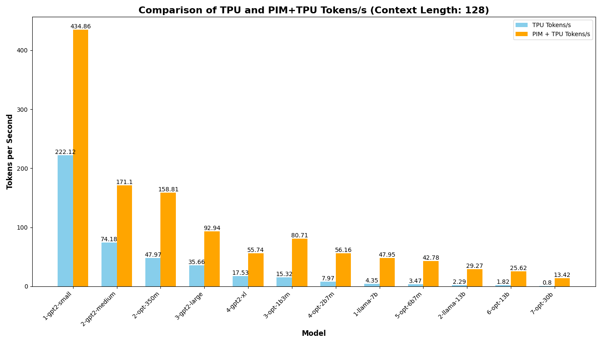
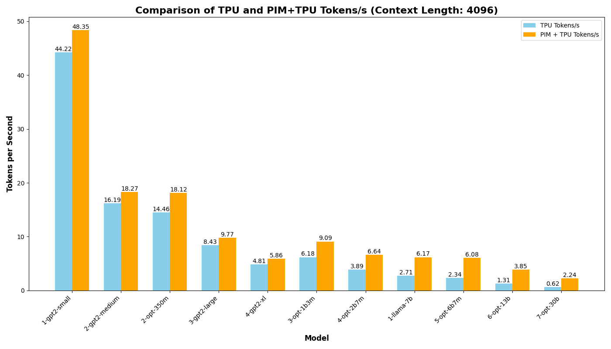

## Updates - September 22, 2024

- Converted latency results to tokens per second for various context lengths in edge and cloud settings.
- Extracted and organized data into CSV files, including:
  - Latency
  - Number of cycles for both TPU and PIM crossbar architectures.
  - Power results : crossbar power, DAC power, ADC power, Buffer power, Other digital part power
  - Layer wise latency results : Layer Index,Total Layer Latency (ns),Computing Latency (ns),Intra-Tile Latency (ns),Inter-Tile Latency (ns),One Layer Merge Latency (ns),Hardware Power Consumption (W)

Some results:

| Edge Context Length 128 | Edge Context Length 4096 |
|-------------------------|---------------------------|
|  |  |

| Cloud Context Length 128 | Cloud Context Length 4096 |
|--------------------------|---------------------------|
|  |  |
